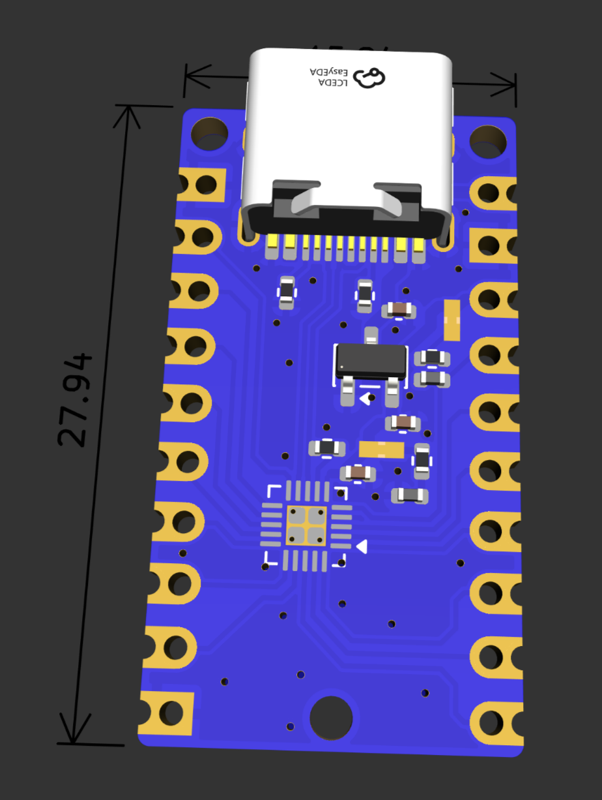
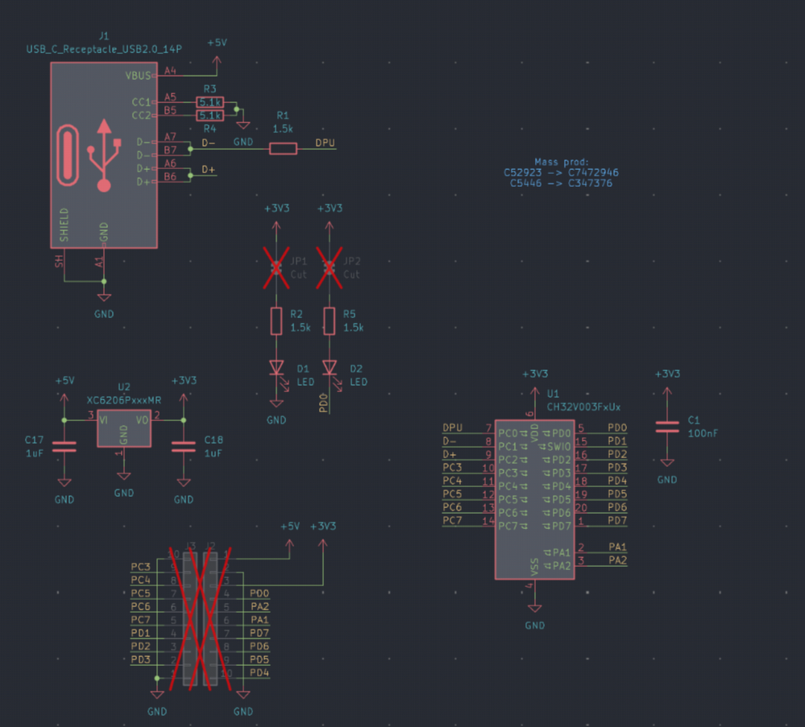
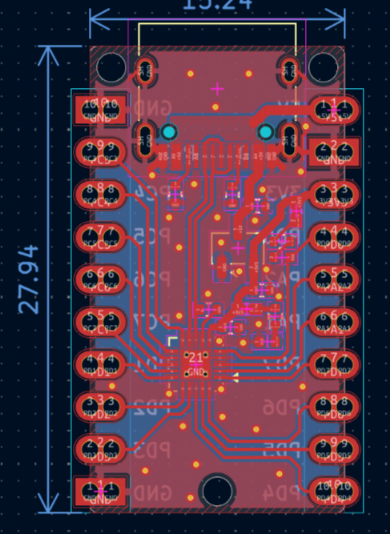

# C32 Devboard

Welp, what else than a tiny c32 devboard? A tiny ch32 device on your fingertips

Features:
- 2 leds
- Low cost
- tiny form
- Nothing much
- USB bootloader via rv003usb
- OPAMPs
- 12 bit ADCs

Everything is also open source, you can see it all in this repo.

The PCB uses a dual layer board in order to save costs, but still maintains a solid ground plane on the back side. It also has an embedded 3v3 ldo.

| Thing | Cost |
| ----- | ---- |
| PCB + PCBA | $115 |
